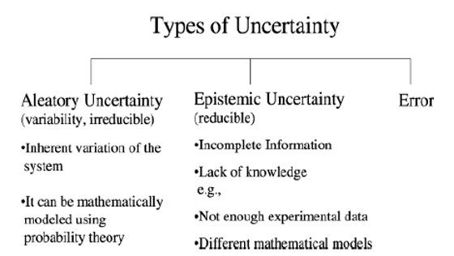

Viability and Resilience of Complex Systems: Concepts, Methods, and Case Studies from Ecology and Society. 2011.

- Two frameworks: attractor-based framework from dynamical system theory and viability theory
    - Viability theory restates the problem accurately: we wish to maintain the system in a region of state space and allows us to propose specific policies
- Dynamical system is defined by N dimensional state variables and time, and an equation stating how these variables evolve with time.
- Equilibrium point: point where dynamics is stopped. Can be stable or unstable. More generally, an attractor is a set of states towards which nearby states in a basin of attraction asymptotically approach.
    - Attractors can be states of a system: ok, good, bad.
- Example of system of savannah grazing dynamics (can use as model for Caltrain system)
- Resilience as the inverse of the return time (see paper for more specific math) (restorative capacity)
- Absorptive capacity: distance to attraction domain boundary
- Can only compare known policies with this framework
- Instead, use viability based definition of resilience: specify resilience of each desired property rather than a system resilience value. (connected to Francis systemic vs. epistemic view)
- Viability kernel originally established to study systems which collapse or badly deteriorate if they leave a given subset of the state space (viability constraint set)
- The capture basin: set of points going to a target set (trajectories that both start and end in C, and the ones that start outside but end inside of C). Analogous to the attraction basin. Capture basin of the viability kernel defines the set of resilient states.
- Can include ideas of what policy should be (adjusting grazing rate in grassland example) and plot effects on viability kernel.
 
Figures to remake: Jackson Figure 1, MITRE figure graph, (combine with Francis graph)

Factors to consider mathematically:
-	speed of onset of disruption: gradual vs fast
-	length of disruption: new normal or acute or multiple
