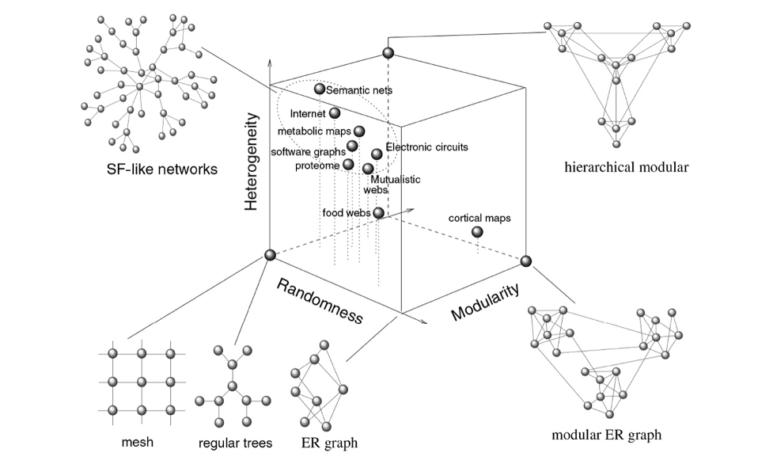

**See also:** [[the_square_and_the_tower_ferguson]]

Over 100,000 nodes in human interactome
Key hypothesis: Disease phenotypes are not single-gene problems. Specific genetic abnormalities spread from one gene product that carries it along the links of the network to affect other genes.

Definitions: 
**protein interaction networks** Nodes are proteins linked to each other by physical binding interactions
**metabolic networks** Nodes are metabolites linked if they participate in same biochemical reactions
**regulatory networks** Directed links represent regulatory relationships between transcription factors or post-translational modifications
**RNA networks** Interactions between regulatory RNAs such as small non-coding microRNAs and siRNAs and DNA
**phenotypic networks** Co-expression patterns
**genetic networks** Double mutant phenotype differs from expected phenotype of single mutatns links genes

Are disease genes placed randomly in the interactome, or are there detectable correlations between their location and their network topology? Several hypotheses result

- In human cells, essential genes encode hubs and disease genes encode peripheral nodes
- Proteins involved in same disease show a high propensity to interact with each other
- Causal molecular pathways coincide with shortest molecular paths
- Shared comopments between diseases indicate phenotypic similarity and comorbidity
- Mutations in interacting proteins lead to similar disease phenotypes

#toread
- Barabasi and Oltvai: Network Biology: understanding the cell’s functional organization. Nature Rev. Genetics, 2004.
- Albert, R. & Barabási, A.-L. Statistical mechanics of complex networks. Rev. Mod. Phys. 74, 47–97 (2002).
- Zhu, X., Gerstein, M. & Snyder, M. Getting connected: analysis and principles of biological networks. Genes Dev. 21, 1010–1024 (2007).
- Caldarelli, G. Scale Free Networks (Oxford Univ. Press, UK, 2007).
- Albert, R. Scale-free networks in cell biology. J. Cell Sci. 118, 4947–4957 (2005).
- Newman, M., Barabási, A.-L. & Watts, D. J.  
The Structure and Dynamics of Networks (Princeton Univ. Press, USA, 2006).

Definitions of modules: 
**topological module** locally dense neighborhood in a network, such that nodes have a higher tendency to link to nodes within same neighborhood than outside it (id using clustering algorithms)
**functional module** Aggregation of nodes of similar or related function in the same network neighborhood
**disease module** neighborhood where nodes contribute to disease phenotype - an important step in network-based approaches to disease is to identify the disease module for the pathophenotype of interest

Disease associated genes typically identified:

- Linkage methods: assume that direct interaction partners of a disease protein are likely to be associated with the same disease phenotype
- GWAS
- Disease-module based approach (pathogen induced phenotypes, bacterial microbiome)
- Diffusion-based methods: ‘random walkers’ released from known diease products and allowed to diffuse along links of interactome

Network-based view of drug action: Most disease phenotypes are difficult to reverse with a single magic bullet which impacts a single node in the network. Drug target networks link approved or experimental drugs to their protein targets

#toread  Loscalzo, J., Kohane, I., Barabási, A.-L. Human disease classification in the postgenomic era: a complex systems approach to human pathobiology. Mol. Syst. Biol. 3, 124 (2007).

