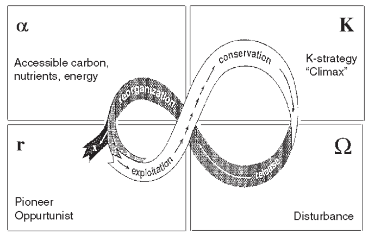

**See also:** [[20210112105644]] toward_a_unified_ecology_allen

Conservation strategies have to actively incorporate the large areas of land that are managed for human use. Particularly relevant for patchy, scattered **landscapes**

For ecosystems to reorganize after large-scale natural and human-induced disturbances, **spatial resilience** in the form of **ecological memory** is a prerequisite. The ecological memory is composed of the species, interactions and structures that make ecosystem reorganization possible, and its components may be found within disturbed patches [[20200326221512]] the_mushroom_at_the_end_of_the_world as well in the surrounding landscape 

Spatial resilience - nearby areas help recovery to avoid irreversible shifts. Internal memory (in patches) vs. external memory (sources of species colonizing disturbed patches)
Previous management was static, aimed at avoiding disturbances - but they are intrinsic parts of the system. Disturbances as pulses. #model 
Static and dynamic reserves

Work on large infrequent disturbances assumes there is always a species or resource for ecosystem reorganization - but not true as reserves become smaller

Static - focused too much on size and connectivity of reserves, humans outside ecosystems
