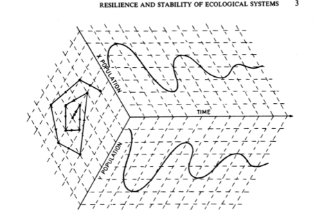
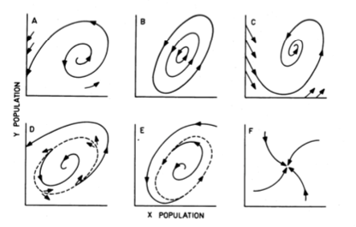

Annual Review of Ecology and Systematics, 4, 1-23, 1973.

- Engineered devices perform specific tasks under a narrow range of predictable external conditions, so a strict quantitative threshold where deviations are immediately counteracted is both possible and important
- “But if we are dealing with a system profoundly affected by changes external to it, and continually confronted by the unexpected, the constancy of its behavior becomes less important than the persistence of the relationships.”
- Shift emphasis from equilibrium states towards the conditions for persistence
- Plot X and Y population vs. time (see fig)  

- Possible behaviors of systems: an unstable equilibrium, neutrally stable cycles, stable equilibrium, domain of attraction, stable limit cycle, stable node.
- Examples with multiple domains of attraction. Key here is not the stability within the domain, but how likely it is for the system to move from one domain to another
- For processes like fecundity, predation, and competition, can use reproduction curves. These plot the population in generation t vs. population in generation t+1, as well as a line with slope 1. Where the two lines cross is an equilibrium. Can also plot the % fecundity and mortality with population density and the cross points will be the same equilibria.
- Likely that realistic M/F curves will result in multiple equilibrium states, some transient and some stable, which will generate domains of attraction, with each domain separated from the others by extinction (ends of graph) and escape thresholds.
- Example: spruce budworm outbreaks in eastern Canada occur following a series of dry years and overgrowth of fir. 
    - Can represent as a large amplitude limit cycle or a distinct domain of attraction periodically exceeded through the chance consequence of climatic conditions.
- Stability: ability of a system to return to an equilibrium state after a temporary disturbance 
- Resilience: budworm forest is tremendously unstable but BECAUSE of this is highly resilient. Caused by negative and positive feedback loops
- Fires as moving forests into one domain of attraction vs. another. Influence of random events (climactic and manmade) as moving from one domain to another.
- Equilibrium view is analytically more tractable but does not always provide a realistic understanding of the systems’ behavior. “A very different view of the world…can be obtained if we concentrate on the boundaries to the domain of attraction rather than on equilibrium states.”
- Spatial heterogeneity also incorporated (ex: tentworm caterpillar)
- Enormous analytical difficulties of treating the behavior of nonlinear systems at some distance from equilibrium
- Extreme climactic conditions leads to more instability but (paradoxically?) more resilience.
- “The balance between resilience and stability is clearly a product of the evolutionary history of these systems in the face of the range of random fluctuations they have experienced”
- Evolution is like a game, but one where the only payoff is to stay in the game. A major strategy selected is not one maximizing efficiency or a particular reward, but one which allows persistence by maintaining flexibility above all else.
- Metrics of resilience: Overall area of domain of attraction and the height of the lowest point in the basin of attraction above equilibrium
- “The stability view emphasizes the equilibrium, the maintenance of a predictable world, and the harvesting of nature’s excess production with as little fluctuation as possible. The resilience view emphasizes domains of attraction and then need for persistence. But extinction is not purely a random event; it results from the inte	raction of random events with those deterministic forces that define the shape, size, and characteristics of the domain of attraction. The very approach, therefore, that assures a stable maximum sustained yield of a renewable resource might so change these deterministic conditions that the resilience is lost or reduced so that a chance and rare event that previously could be absorbed can trigger a sudden dramatic change and loss of structural integrity of the system.”
- “Flowing from [the resilience management approach] would be not the presumption of sufficient knowledge, but the recognition of our ignorance; not the assumption that future events are expected, but that they will be unexpected.”
