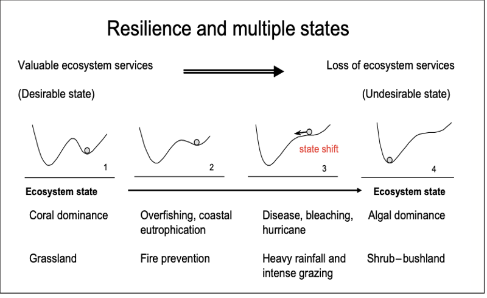

###### Metadata
ID: 20210112112609
#literature #reference
#author Thomas Elmqvist, Carl Folke, Magnus Nyström, Garry Peterson, Jan Bengtsson, Brian Walker, and Jon Norberg
#title Response diversity, ecosystem change, and resilience
#resilience #ecology 
See also: 

“Nature is not fragile . . . what is fragile are the ecosystems services on which humans depend”. (Levin 1999) #quote

Landscape changes shape as well as state moving through it. What are the mathematical dynamics here? #model