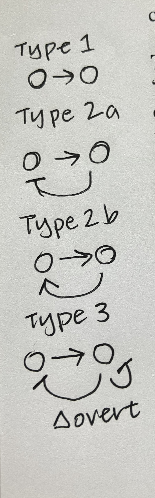

Emergence paradoxes arise mainly because we are often only able to see a part of a complex system. 

Emergent software bugs: unexpected faults in software systems

Self-organization among social animals usually involves an emergence 'trick' - the pheremone trick (chemotaxis) or the flocking trick (quorum sensing)

> "Emergence is hard to capture with a model or theory, just because during an emergence process new and unpredictable entities appear, which are governed by their own laws." 

CM: This could be part of our manifesto - emergent entities?

Descriptive emergence vs. explanatory emergence (similar to strong/weak)

"Benign and radical" emergence (CM: more fun?) William Seager

Type I - Simple/Nominal Emergence without top-down feedback 
- Type Ia - Simple intentional emergence
- Type Ib - Simple unintentional emergence

Type II - Weak emergence (including top-down feedback)
- Type IIa - Weak emergence (stable) - negative feedback
- Type IIb - Weak emergence (instable) - positive feedback

Type III - Multiple emergence with many feedbacks
- Type IIIa - stripes, spots, bubbling
- Type IIIb - Tunneling, adaptive emergence
Type IV - Strong emergence

Type 1 is basically self-organization. New roles are assigned to agents and actors. But brittle and lacks flexibility

Type 2 can be derived from the microscopic dynamic but only by simulation. 

Indirect interaction - changes the state of the total system and environment. Direct interaction via groups and clusters.

> "Negative or damping feedback leads to stable forms of weak emergence, positive or amplifying feedback results in unstable form as short-lived fads, bubbles, and buzz."

> "In stable forms of weak emergence there is a balance between exploration, diversity and randomness (through bottom-up influences) on the one hadn't and exploitation, unity, and order (through top-down constraints) on the other hand."

> "Complex scale-free or small-world networks are especially vulnerable to cascades." 

activator-inhibitor systems and belong to reaction-diffusion systems. For short-ranges the positive feedback prevails for long-ranges that negative feedback takes hold (stripes and spots)

Short-term positive feedback (blind imitation) and long-term negative feedback (careful consideration)

> "Abrupt, unsteady changes and jumps in complexity are the consequence of unsteady fitness landscapes and barriers." 

Murray Gell-Mann - gateway events that open up new realms of possibility