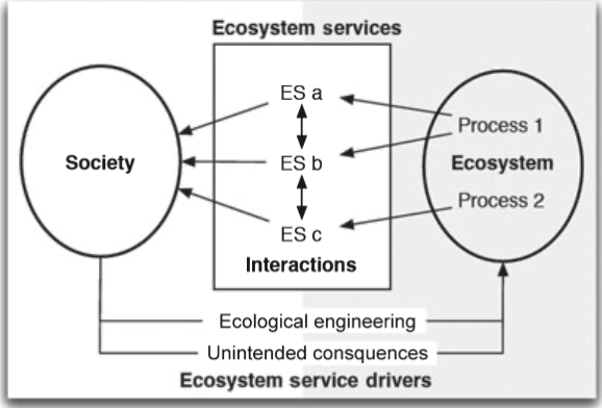

###### Metadata
ID:  20210118205339
#literature #reference
#author 
#title Understanding Relationships Among Ecosystem Services
#resilience
See also: 
Maximizing production of one ecosystem service often results in declines in other services
Need multiobjective optimization! #model

Ex. Change of mangroves to shrimp farming changes supply of a set of ecosystem services.
