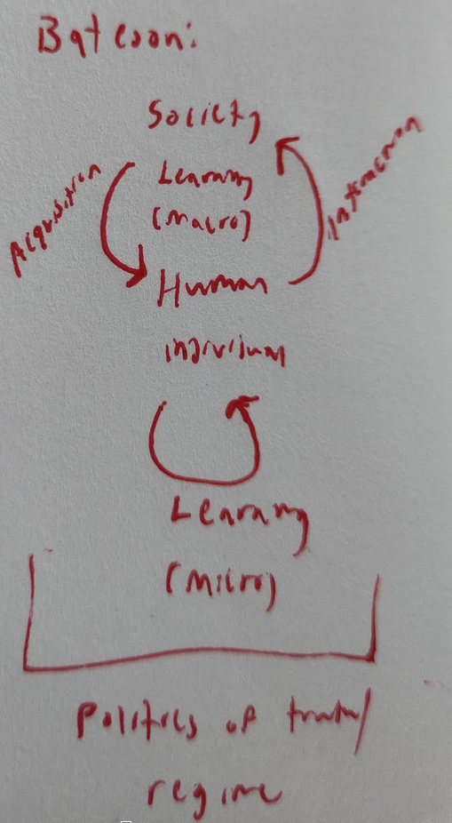

# Overview

LCU: (Part I of) this paper gives us 2 things that are relevant to this workshop. One is a background: this paper helps us understand the historical specificity of the philosophical assumptions/commitments that our sciences simultaneously emerged from and facilitated (and therefore of the knowledge claims they enable). The other is a framing: I think the concept of "emergence" is offering us something very politically powerful, and Wynter helps us with the kind of deep engagement needed to articulate what new possibilities we're reaching for. As she argues, it's not possible to access knowledge that's not implicated in politics - but there's also evidence that it's possible for knowledge to implicate new politics.

# General notes

LCU: Argument - all contemporary struggles can be linked to the onto-epistemological dominance/over-representation of one definition/perspective regarding what the human is (which Wynter refers to as a "descriptive statement"). That is, of course, the Western European definition, which Wynter refers to as "Man."

LCU: Corollary - The rise of the West and the subjugation of everyone else (Africa - enslavement, Latin America - conquest, Asia - subjugation) can be mapped to the development/enactment of this descriptive statement. In fact, colonialism could only be enaced on the basis of the new descriptive statement.

LCU: History - "Man" was invented as a reaction to or transumption of the West's previous social order, in which the clergy subjugated the lay-world (who were "imprisoned \[...] in marriage"). The state needed to propose/enact a new logic to center itself as the dominant institution, and also (incidentally) to give itself the authrority to expand and conquer. The descriptive statement switched from "Christian" to "Man," and people were conditioned to consider themselves political subjects rather than religious subjects.

LCU: Part 1 - the Janus face of the invention of man. Face 1 = the distinction between supernatural and natural causality (i.e. the invention of rationality). Part 2 = the distinction between colonizer and colonized (i.e. the invention of race). The concept/distinction of race replaces the distinction between human and supernatural. The descriptive statement of the human (built to make sense of what it means to be human) required another category - where once that other category was God or the ancestors or the supernatural, the new rational paradigm created a human Other to define itself against. In other words, the colonized were understood to be extrahuman because they were considered non-normal (whether because they were "non-rational" (in the case of the indigenous american) or because they were "subhuman" (in the case of the African)). The development of these categories of extrahuman (irrational and subhuman) map to the invention of natural causality (see: the physical sciences) and "nature" (see: the life sciences), respectively. 

# Annotations

## Guide-Quotes

> The specifically intellectual form of the operation -- self-definition -- masks its universal content which is the reproduction and reinforcement of a given social configuration, and -- with it -- a given (or claimed) status for the group.
>   - Zygmunt Bauman, Legislators and Interpreters: On Modernity, Post-Modernity, and Intellectuals

> The Church became a society of bachelors, which imprisoned lay society in marriage.
>   - Jacques Le Goff, The Medieval Imagination

> The intellectual's schizoid character stems from the duality of his social existence; his history is a record of crises of conscience of various kinds \[...]
>   - George Konrad, Ivan Szelenyi, The Intellectuals on the Road to Class Power

## Part 1

The process of reinvention of the category of "human" (from "Christian" to "Man") happened in two forms:
> The first was from the Renaissance to the eighteenth century \[...] making possible \[...] conceptualizability of natural causality \[...] with this, in turn, making possible the cognitively emancipatory rise and gradual development of the physical sciences (in the wake of the invention of Man1)
> the second was second was from then on until today, thereby making possible both the conceptualizability of \[...] nature as an autonomously functioning force in its own right governed by its own laws \[...] with this, in turn making possible the cognitively emancipatory rise and gradual development of \[...] the biological sciences (in the wake of the nineteenth century invention of Man2).

> These were to be processes made possible only on the basis of the dynamics of a colonizer/colonized relation that the West was to discursively constitute and empirically institutionalize

> "Race" was therefore to be, in effect, the non-supernatural but no less extrahuman ground (in the reoccupied place of the traditional ancestors/gods, God, ground) of the answer that the secularizing West would now give to the Heideggerian question as to the who, and the what we are.

> \[The West transformed Native Americans and Africans] into the physical referents of its reinvention of medieval Europe's Untrue Christian Other to its normative True Christian Self, as that of the Human Other to its new "descriptive statement" of the ostensibly only normal human, Man.

'the "Indians" were portrayed' as irrational, while Black Africans were 'constructed as \[...] "racially inferior"

LCU: Based on 1) rationality, and then 2) scientific racism

LCU: Wynter argues that Western knowledge production processes *needed* to deried other cultures' knoledge systems to make their definition of the human work. It wasn't just chauvinism, it was part of the project.

> this population group's systemic stigmatiziation, social inferioritization, and dynamically produced material deprivation thereby serving both to "verify" the overrrepresentation of Man as if it were the human, and to legitimate the subordination of the world and well-being of the latter to those of the former.

> All of this was done in a lawlike manner through the systemic stigmatization of the Earth in terms of its being made of a "vile and base matter," a matter ontologically different from that which attested to the perfection of the heavens

LCU: This idea is explicated in a richer way later, so I'll comment on it then.

LCU: Wynter refers to Bateson and Fanon to think through the implications for learning and knowledge production.
LCU: Bateson - the politics of truth (or the regime, as Foucault puts it) reproduces itself across scales.

(LCU: This diagram doesn't completely capture what Wynter says about Bateson, but I hope it gets at the relationship between society's learning and individual learning)

LCU: Fanon explains how the regime "dictates that Self, Other, and World should be represented and known," which means both that everyone in the current regime is socialized to be anti-Black, and also that Black voices are disregarded and excluded from discourse.

LCU: A society's learning systems preserve and reinforce its regime. Wynter argues that we cannot escape from epistemology - when we seek truth, the truth is always "for" something.

> the adaptive truth-for terms in which each purely organic species must know the world is no less true in our human case. \[...] our varying ontogeny/sociogeny modes of being human, as inscribed in the terms of each culture's descsriptive statement, will necessarily give rise to their varying respectrive modalities of adaptive truths-for, or epistemes.

LCU: Even knowledge that's meant to be objective will be oriented toward re-inscribing the dominant perspective. In fact, a culture will often use knowledge that appears to be objective (e.g. astronomy) to absolutize their "descriptive statement" about what it means to be a) human and b) a good person. Is knowledge that's meant to resist the dominant regime also, in some way, oriented toward reproducing it? I certainly don't know.

LCU: In our culture's case, one result of the descriptive statement is "the still unbreachable divide between the "Two Cultures"" (the sciences and the humanities). Let's make our best attempt to breach that divide anyway.

> Godelier writes, as human beings who live in society, and who must also produce society in order to live, we have hitherto always done so by producing, at the same time, the mechanisms by means of which we have been able to invert cause and effect, allowing us to represe the recognition of our collective production of our modes of social reality \[...] Cental to these mechanisms was the one by which we projected our own authorship of our societies onto the ostensible extrahuman agency of supernatural Imaginary Beings.

LCU: For the Greeks, matter was understood to be nonhomogenous (there existing a gradation between the perfection of the heavens and the impermanence of the earth). Wynter argues that medieval Europe Christainized this idea as the ""Redeemed Spirit" (as actualized in the celibate clergy) and the "Fallen Flesh" enslaved to the negative legacy of Adamic Original Sin, as actualized by laymen and women." 

> \[Core to the Renaissance's innovation was] the conceptual break made with the Greco-Roman cum Judeo-Christian premise of a nonhomogeneity of substance \[...] as the break that was to make possible the rise of a nonadaptive, and therefore natureal-scientific, mode of cognition wiht respect to the "objective set of facts" of the physical level of reality: with respect to what was happening "out there."

LCU: The new idea was that all substance is homogenous, and therefore that it follows the same laws. Where before knowledge of the world was considered impossible because heaven could, at any moment, decide to intervene directly, now it was possible to learn the gears that turned beneath the surface. But this revolution was "mounted" from the perspective of folks who "had until then been compelled to think and work within the very theocentric paradigms that legitimated the dominance of" the church "over the lay world." So how did they manage that? They framed their new ideas as a "return" to the traditions of thought that the medieval paradigm rose out of.

LCU: Where before the human was largely incidental to God's creation, the humanists' framing placed "Man" at the center. If God created the world for man's sake, then it must be possible for man to understand the world (otherwise what's the point).

> \[God] would have had to make \[the world] according to rational, nonarbitrary rules that could be knowable by the beings that He had made it for.

LCU: This idea would have been legible to the Medieval worldview, but it still offers possibilities for alternative social orders.

LCU: So what's the problem? Well, this view of the world (and the human's place in it) is "ontologically absolute."

> All other modes of being human would instead have to be seen not as the alternative modes of being human that they are "out there," but adaptively, as the lack of the West's ontologically absolute self-description. \[...] This central oversight would then enable both Western and westernized intellectuals to systemically repress what Geertz has identified as the "fugitive truth" of its own "local culturality" (Geertz 1983) -- of, in Bruno Latour's terms, its specific "constitution with a capital C," or cultural constiution that underlies and charters our present order" (Latour 1991)

LCU: I think all this is important because we can use it to frame what emergence (as a concept) offers us philosophically and politically. I haven't done the research to back this up, but I'd argue that a lot of socially-harmful Western assumptions (e.g. that the whole world should develop along the same trajectory that was charted out by the "global North") are embedded in the idea that all matter (and people) must follow the same fundamental laws in all contexts. Emergence is a bit of a challenge to that, right? On the [complex systems side](anderson-more-is-different.md), we have the idea that the behavior of higher-level systems cannot be derived from the behavior of lower-level systems, which we can use to argue that, say, societies need not look the same even if people are largely similar across contexts. On the [assemblages side](ball-on-delanda-assemblages.md), we have ontologically robust descriptions of how historical and contextual contingency is necessarily part of how a phenomenon operates. In the same way that the humanists used religious logic to create a new politics of logic from inside of the previous one, emergence might help us get away from Western rationality's self-enclosure, its inability to properly see other ways of being, and its subordination of everyone else in the world.

